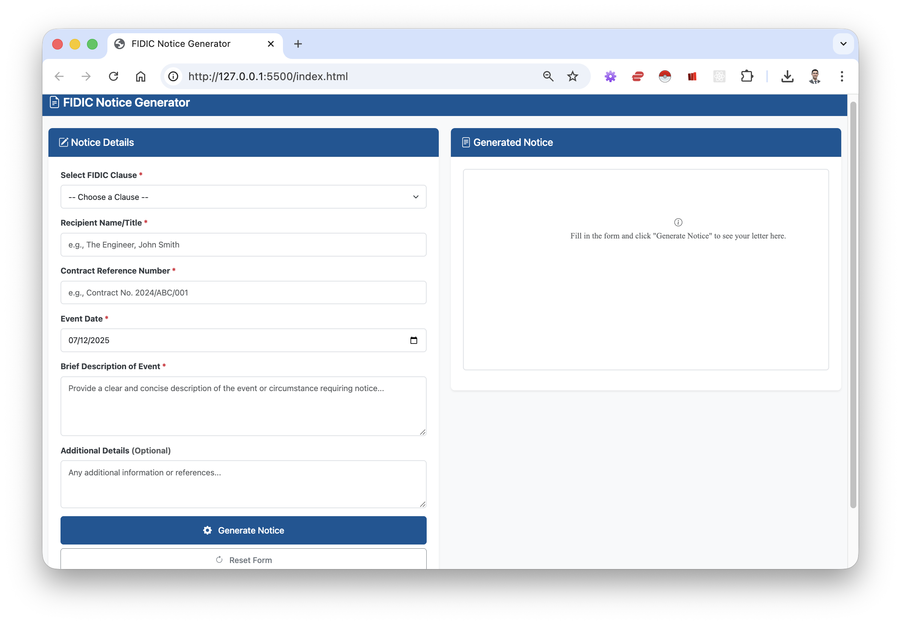

# M2U1 | Individual Assignment

## FIDIC Notice Generator

A professional web-based utility designed for construction engineers and contract administrators to generate legally compliant FIDIC contractual notices quickly and accurately.



## 📋 Overview

The **FIDIC Notice Generator** solves the business problem of incorrect or delayed contractual notices by automating the drafting process. Site engineers often struggle to recall specific sub-clauses and proper formatting for formal notices. This tool ensures that when correct input data is provided, the output is legally sound and professionally formatted.

## ✨ Features

- **4 Pre-built FIDIC Templates**
  - Sub-Clause 1.9: Delayed Drawings or Instructions
  - Sub-Clause 4.2: Performance Security
  - Sub-Clause 8.3: Programme
  - Sub-Clause 20.1: Contractor's Claims

- **User-Friendly Interface**
  - Clean, professional Bootstrap-based design
  - Blueprint Blue (#005696) color scheme matching construction industry aesthetics
  - Fully responsive (works on mobile and desktop)

- **Powerful Functionality**
  - Real-time preview of generated notices
  - One-click copy to clipboard
  - PDF download capability
  - Form validation for data integrity
  - Professional, contractual tone maintained throughout

## 🎯 Success Metrics

- Generate a compliant notice in under 60 seconds
- Zero editing required before sending
- Professional formatting maintained across all outputs

## 🚀 Getting Started

### Prerequisites

No installation required! This is a pure front-end application that runs entirely in the browser.

### Usage

1. Open `index.html` in any modern web browser
2. Select the appropriate FIDIC Clause from the dropdown
3. Fill in the required fields:
   - Recipient Name/Title
   - Contract Reference Number
   - Event Date
   - Brief Description of Event
   - Additional Details (optional)
4. Click "Generate Notice"
5. Review the preview and either:
   - Copy to clipboard for pasting into email/documents
   - Download as PDF for formal submission

### Sample Output

See [FIDIC_Notice_1.9_2025-12-07.pdf](docs/FIDIC_Notice_1.9_2025-12-07.pdf) for an example of a generated notice.

## 🏗️ Technical Architecture

### Technology Stack

- **HTML5** - Semantic structure
- **Bootstrap 5.3.2** - Responsive UI framework
- **CSS3** - Custom styling and theming
- **JavaScript (ES6+)** - Application logic and templating
- **jsPDF** - Client-side PDF generation

### File Structure

```text
M2U1IA/
├── index.html          # Main application interface
├── styles.css          # Custom styling (Blueprint Blue theme)
├── app.js              # Core logic, templates, and event handlers
├── docs/
│   └── PRD_ FIDIC Notice Generator.md   # Product Requirements Document
├── FIDIC_Notice_1.9_2025-12-07.pdf     # Sample output
└── README.md           # This file
```

## 📐 Development Process

### How the PRD Guided Development

The application was built following the [Product Requirements Document](docs/PRD_%20FIDIC%20Notice%20Generator.md) specifications:

#### 1. **User Flow Implementation (Input → Process → Output)**

**From PRD:** *"The application will function based on a linear Input → Process → Output model"*

**Implementation:**

- **Input Layer:** Created a Bootstrap form with all required fields (Clause Selector, Recipient Name, Contract Reference, Event Date, Description)
- **Processing Layer:** Implemented conditional logic using JavaScript template literals that map clause selection to specific notice templates
- **Output Layer:** Built a real-time preview pane with copy-to-clipboard and PDF download functionality

#### 2. **Functional Requirements Mapping**

**A. Input Interface (PRD Section A)**

*Requirement:* "Clause Selector: A dropdown menu containing Sub-Clauses 1.9, 4.2, 8.3, 20.1"

*Implementation:*

```javascript
const noticeTemplates = {
    "1.9": { title: "Sub-Clause 1.9: Delayed Drawings or Instructions", ... },
    "4.2": { title: "Sub-Clause 4.2: Performance Security", ... },
    "8.3": { title: "Sub-Clause 8.3: Programme", ... },
    "20.1": { title: "Sub-Clause 20.1: Contractor's Claims", ... }
};
```

Each template includes professionally crafted contractual language that follows FIDIC standards.

**B. Processing Logic (PRD Section B)**

*Requirement:* "IF Selection == 'Clause 1.9' THEN Load Template and Replace {Date} with User Input"

*Implementation:*

```javascript
function generateNotice() {
    const selectedClause = clauseSelector.value;
    const template = noticeTemplates[selectedClause];
    
    const data = {
        recipientName: recipientName.value.trim(),
        contractRef: contractRef.value.trim(),
        formattedDate: formatDate(eventDate.value),
        eventDescription: eventDescription.value.trim(),
        additionalDetails: additionalDetails.value.trim(),
        subject: template.subject
    };
    
    generatedNotice = template.template(data);
}
```

**C. Output Specifications (PRD Section C)**

*Requirement:* "Preview pane that updates in real-time, Copy to Clipboard button, professional tone"

*Implementation:*

- Real-time preview with proper letter formatting
- Async clipboard API for one-click copying
- jsPDF integration for professional PDF output
- All text maintains formal, contractual language with no slang

#### 3. **UI/UX "Vibe" Adherence**

**From PRD:** *"Minimalist, high-contrast, professional. Color Palette: Blueprint Blue (#005696), White, and Dark Grey"*

**Implementation:**

```css
:root {
    --blueprint-blue: #005696;
    --dark-grey: #343a40;
    --light-grey: #f8f9fa;
}
```

- Used Bootstrap's professional card-based layout
- Applied Blueprint Blue (#005696) to primary elements (navbar, buttons, headers)
- High contrast white text on dark backgrounds
- Minimalist design with clear visual hierarchy
- Times New Roman font for preview area (professional, document-like appearance)

#### 4. **Responsive Design**

**From PRD:** *"Must work on mobile (for engineers on site) and desktop"*

**Implementation:**

- Bootstrap's responsive grid system (col-lg-6 for side-by-side on desktop)
- Mobile-first CSS with media queries for different screen sizes
- Touch-friendly button sizes on mobile devices
- Optimized preview area height for various viewports

#### 5. **Success Metrics Achievement**

**From PRD:** *"User can generate a compliant Sub-Clause 1.9 notice in under 60 seconds. Generated text requires zero editing before sending."*

**Implementation:**

- Simple 5-field form with clear labels
- Default date set to today for convenience
- Form validation prevents incomplete submissions
- Pre-written templates ensure legal compliance
- One-click operations for copy and download
- Professional formatting applied automatically

### Design Decisions

1. **Pure Front-End Architecture:** No backend required, making it easy to deploy and use offline if needed
2. **CDN Dependencies:** Used Bootstrap and jsPDF from CDNs for lightweight, maintenance-free deployment
3. **Template Literal Functions:** Flexible template system allows easy addition of new clauses
4. **Date Formatting:** Converts ISO dates to formal "Month Day, Year" format for professional appearance
5. **Error Handling:** Comprehensive validation and user feedback via Bootstrap alerts

## 🔧 Customization

### Adding New FIDIC Clauses

To add a new clause template, edit `app.js` and add to the `noticeTemplates` object:

```javascript
"X.X": {
    title: "Sub-Clause X.X: Your Title",
    subject: "NOTICE PURSUANT TO SUB-CLAUSE X.X",
    template: (data) => `
        Your template text with ${data.recipientName} variables...
    `
}
```

Then add the option to the dropdown in `index.html`.

### Modifying Styles

Edit `styles.css` to change:

- Color scheme (update CSS variables in `:root`)
- Layout spacing
- Typography
- Button styles

## 📄 License

This project is licensed under the terms specified in the LICENSE file.

## 🤝 Contributing

This tool was developed to meet specific PRD requirements. Suggestions for additional FIDIC clauses or improvements are welcome.

## 📞 Support

For issues or questions, please refer to the documentation in the `docs/` folder or review the PRD for design intent.

---

**Built with precision for construction professionals** 🏗️
